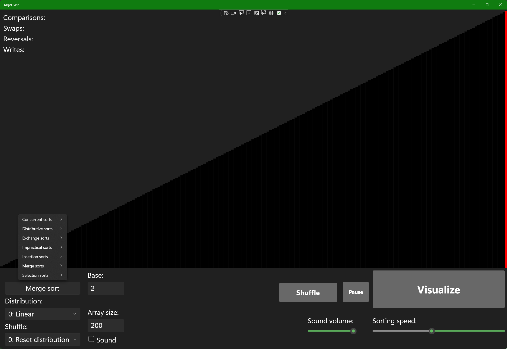

# AlgoUWP
Extremely WIP and barely of the description, but it's an improved UWP port of KrasiF's sorting algos, a WPF program.

Note that this is how it looks in dark mode. It'll be on light mode if it's the default mode that you set in your system settings.

Major credit to ArrayV (https://github.com/Gaming32/ArrayV-v4.0) for the shuffles and distributions. The following shuffles and distributions either don't work right or make the program crash:
- Tangent wave
- Shifted element
- Final merge pass
- Binary search tree traversal
- Inverted binary search tree
- Final pairwise pass
- Recursive reversal
- Gray code fractal
- Grailsort adversary
- First circle pass
- half reversal
- inverted pipe organ
- PDQsort adversary

# Guide for adding your own algorithms
- Add a new MenuFlyoutItem under comboBox for the algorithms in the XAML, and then go to the code-behind (the .xaml.cs file) and into `Visualize_Click(...)`, and add a new "case" with the name of the new algorithm. For example, if your new algorithm is odd-even sort, then add below a `break;`:
```csharp
case "Odd-even sort":
  OddEvenSort(arr, arr.Length);
  DrawHistory();
  break;
```
- ...The function that calls the algorithm should have `arr` as the argument that refers to the array to be sorted, and, if there's any, `arr.Length` as the argument that refers to the length of that list, and just `0` as the argument that refers to the start of the list.
- It doesn't matter if the algorithm is declared as a void or int or int[], or public or private. What matters is that it shouldn't be static or async, or else errors would occur and you'll need to do some complicated workarounds in order to get the program to accept static and/or async algorithms.
- In order for the program to properly log it, you should do writes, comparisons, and swaps in the ArrayV way:
- Instead of something like "if (x[n] > y[n])" or "if (x[n] < y[n])", use (respectively) "if (CompareValues(x[n], y[n]) > 0)" or "if (CompareValues(x[n], y[n]) < 0)"
- For swaps, use:
```csharp
//Instead of doing this...
int temp = arr[a];
arr[a] = arr[b];
arr[b] = temp;

//...do this instead
Swap(arr, a, b);
```
- For writes, use:
```csharp
//Instead of doing this...
arr[at] = equals;

//...do this instead
Write(arr, at, equals);
```
